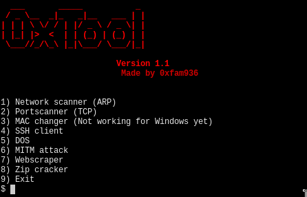
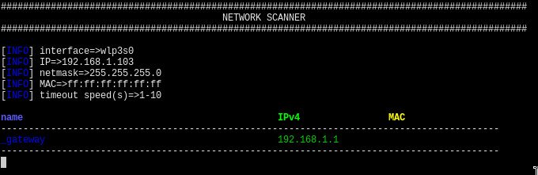
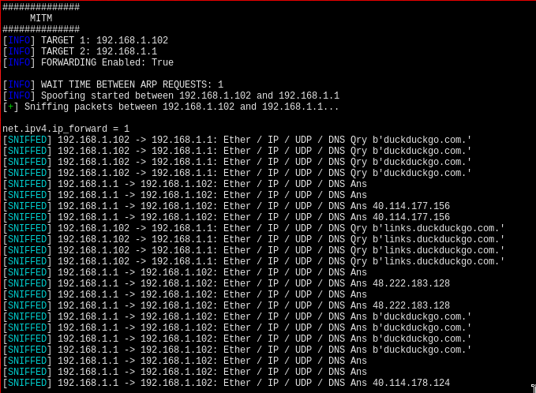

# 0xTool - Network & Assessment Toolkit



**0xTool** is a cross-platform Python toolkit consolidating essential network reconnaissance and assessment utilities into a single interface. 

## 🚀 Technical Features & Modules

### 🔍 Reconnaissance & Enumeration
* **Network Scanner:** Performs rapid ARP-based host discovery across local subnets using `scapy`, complete with MAC address resolution and automated hostname lookups.
  <br>
* **Port Scanner:** A TCP connect scanner utilizing Python `socket` connections with customizable timeout management for optimized scanning speeds.
* **Asynchronous Web Scraper:** An extremely fast, concurrent web scraper built with `aiohttp` and `asyncio`. It uses connection pooling, rate-limiting (semaphores), and regex to systematically extract emails, phone numbers, and social media footprints from target domains.

### ⚔️ Network Manipulation & Attacks
* **MITM (Man-in-the-Middle):** Executes ARP cache poisoning to intercept traffic between a target and a gateway. Utilizes multithreading to sniff and decode HTTP requests (extracting methods, paths, and headers) in real-time without blocking the main spoofing loop. Handles OS-level IP forwarding automatically.
  <br>
* **DOS:** Performs Denial of Service stress testing (useful for testing network resilience and rate-limiting rules).
* **MAC Changer (Linux Only):** Anonymizes hardware MAC addresses to bypass basic network access controls.

### 🛠️ Access & Cryptography Utilities
* **Zip Cracker:** Features both dictionary/wordlist attacks and dynamic brute-force generation (using `itertools.product` generators for memory efficiency) to recover passwords from encrypted `.zip` archives.
* **SSH Client:** Establishes secure remote connections for post-exploitation or remote management using `paramiko`.

## ⚙️ Prerequisites & Dependencies

* **Python 3.6+** (Tested on Python 3.13+)
* Requires administrative/root privileges for raw socket manipulation (ARP spoofing, network scanning).

Core libraries utilized include:
`Scapy` (Packet crafting), `aiohttp` & `asyncio` (Async networking), `beautifulsoup4` (HTML parsing), and `colorama` (Terminal UI).

## 💻 Installation & Setup

It is highly recommended to run this tool within an isolated Python virtual environment.

```bash
# Clone the repository
git clone [https://github.com/yourusername/0xTool.git](https://github.com/yourusername/0xTool.git)
cd 0xTool

# Create and activate the virtual environment
python3 -m venv .venv
source .venv/bin/activate  # On Windows use: .venv\Scripts\activate

# Install the required dependencies
pip install -r requirements.txt
```

## 🎯 Usage

Ensure your virtual environment is active and you have the necessary privileges (run as root/administrator if utilizing `scapy` modules like MITM or Netscan).

Launch the toolkit via the main script:

```bash
python src/main.py
```

## ⚠️ Disclaimer

> **Strictly for Educational Purposes:** This toolkit is strictly for educational purposes only. Do not use these tools on networks or systems for which you do not have explicit and written permission. The developer assumes no liability for misuse or damage caused by this software.
